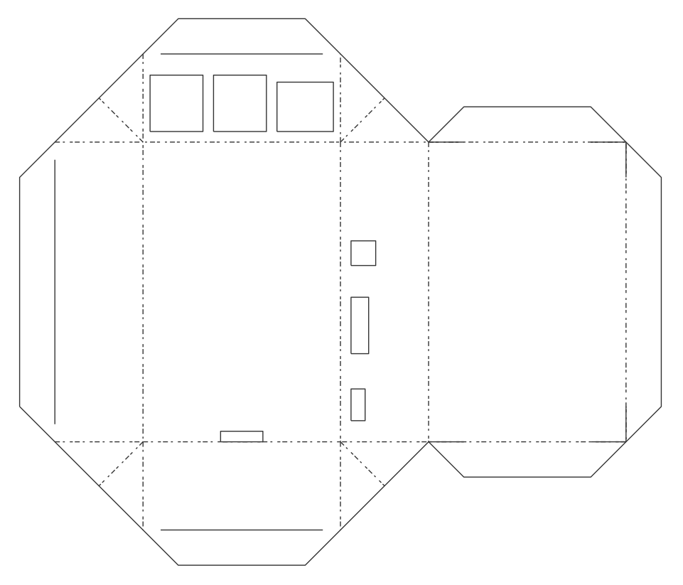
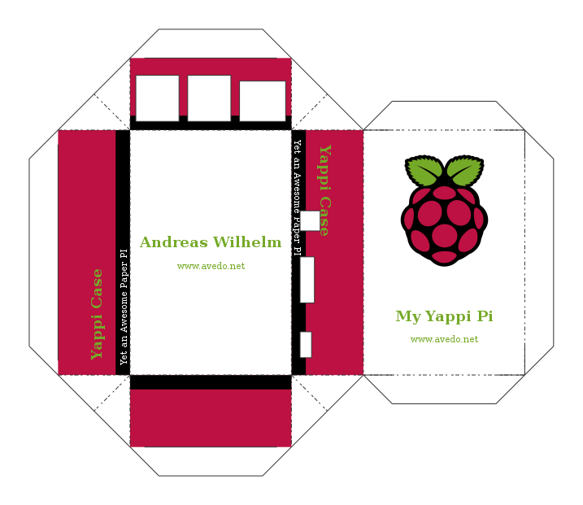
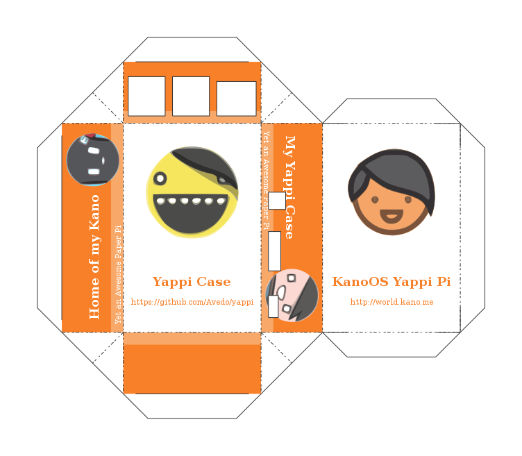

# Yappi

Yappi - Yet an Awesome Paper PI - is a plugin for the famous vector graphics software **Inkscape**.

## Installation

To install this plugin you should first download the sources from GitHub:

    $ git clone https://github.com/Avedo/Yappi

Then you can move the downloaded files to the extentions folder of your Inkscape installation:

    $ sudo cp ./Yappi/yappi.* /usr/share/inkscape/extensions/

## Usage

If you now start Inkscape, you should see a new entry in the `Extentions -> Python` submenu, named `Yappi`. Open a new document, go to `Files -> Document Properties ...` and choose `A4` paper and check `Landscape` mode. Now start the Yappi extension wizzard located under `Extensions -> Python -> Yappi ...`. Here you can change different options modifying the look and feel of your custom Raspberry Pi case. When you entered all important data, click `Apply` and close the wizzard. You will see the scheme of your custom Raspberry Pi case.

## License

The Yappi Inkscape plugin is licensed under the terms of the Apache License 2.0.

## Examples and Screenshots

